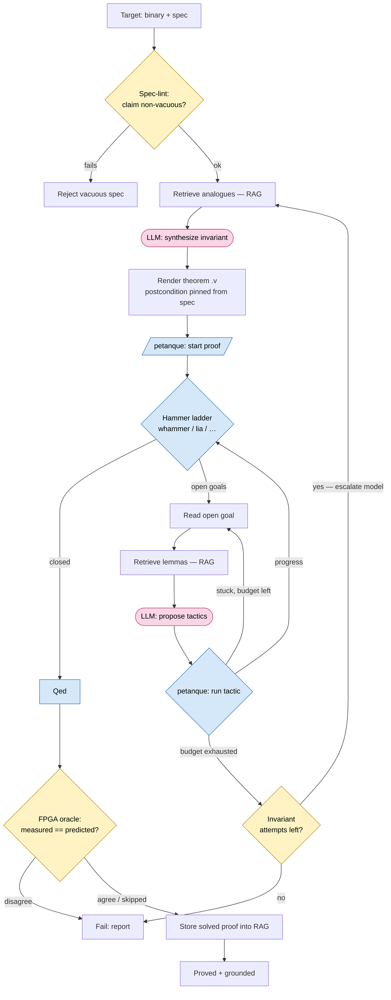

# A primer on the cloq-agent LLM loop

A teaching companion to [`PRIMER.md`](PRIMER.md). The primer explained the *proof* side — how a
Cloq timing proof works. This explains the *AI* side — how a local language model is wired into that
proof process to guess the one creative ingredient, without ever being trusted. It assumes you've
read the primer (so you know what an invariant, `whammer`, and `satisfies_all` are) but no machine-
learning background.

---

## The one job the LLM has

The punchline of the primer was: in a Cloq proof, **the only creative input is the loop invariant.**
Everything else — stepping, simplifying, `lia`, `whammer` — is deterministic machinery. So this
entire system exists to produce one thing: a good invariant (and, as a fallback, the occasional
repair tactic when automation stalls).

That gives us the single most important principle, and it's also the answer to "could a wrong guess
produce a wrong proof?":

> The LLM is a **generator** — it proposes. Rocq, driven through petanque, is the **verifier** — it
> checks. **The generator is never trusted.** A wrong guess doesn't produce a wrong proof; it produces
> a *failed* proof, which the loop notices and retries.

This is the **generator–verifier** (or proposer–checker) pattern, and it's why it is *safe* to put a
fallible model at the center of a correctness-critical task. Compare it to using an LLM to write a
medical summary, where a wrong guess silently becomes a wrong answer. Here a wrong guess hits a wall
of formal logic and bounces. The model can be wrong most of the time and the system stays sound — it
just has to be right *often enough* to be useful. Making it right often is the open research; making
it *safe* is free, by construction. Everything below is in service of raising the hit-rate without
ever trusting the model.

---

## The loop at a glance



**Legend.** Pink stadium nodes are the **generator** (the LLM proposing — untrusted). Blue
parallelogram/diamond nodes are the **verifier** (petanque/Rocq checking — trusted). Yellow diamonds
are **gates** (spec-lint, budget, FPGA) that can reject. Read the picture as: every pink node is a
*guess*, every blue node is a *check*, and nothing the model writes enters the trusted artifact
without passing through blue. (This renders on GitHub/GitLab; in a plain editor you'll see the source.)

---

## Part 1 — the concepts, step by step

### Step 1 — How you talk to an LLM at all (`models.py`)

A **large language model (LLM)** is a function: text in, text out, generated one **token** (≈ a
word-piece) at a time. To use one from code you send an HTTP request to a **serving** process that
holds the model's **weights** (its learned parameters) in GPU memory and runs **inference** (the
forward pass that produces tokens).

Terms you'll set:

- **System prompt vs. user prompt.** The system prompt is standing instructions ("you are a Cloq
  expert; output only a Coq `Definition`"); the user prompt is the specific task. Separating them
  keeps the model's role stable across many different calls.
- **Temperature.** A 0-to-~1 randomness knob. Low (0.2) = pick the most likely next token,
  deterministic and focused — good for tactic repair. Higher (0.4–0.7) = more variety — good when you
  want *several different* invariant guesses rather than the same one repeatedly.

The repo isn't tied to one vendor: it uses the **OpenAI-compatible API**, the de-facto standard that
local servers also speak, so the same code drives **Ollama** or **vLLM** running Qwen-Coder on the
5090, or a cloud model, by changing a URL. The `escalate` flag implements **escalation**: hard goals
that exhaust the local model's budget get one shot at a stronger model — spend the cheap one first,
reach for the expensive one only when stuck.

### Step 2 — How you talk to the *prover* programmatically (`proof/petanque_driver.py`)

In the primer you typed tactics into an editor. To let a *program* drive the proof we need an API into
Rocq: **petanque** (the proof engine inside coq-lsp) and its Python client **pytanque**. Think of it
as a "gym" for proofs. Three operations, wrapped in `PetanqueDriver`:

- `start(file, theorem)` — open a `.v` file at the start of a theorem's proof; returns a **state** (an
  opaque handle for "where we are").
- `run(state, tactic)` — apply one tactic; returns a new state, whether the proof **finished**, and —
  crucially — if the tactic errored, it *captures* the error instead of crashing, so the agent can
  read it and repair.
- `goals(state)` — read the open **goals** (hypotheses + what's left to prove), pretty-printed as text
  the LLM can read.

The key property is that this is **functional**: each `run` returns a *fresh* state, so a failed
tactic doesn't corrupt the state you tried it from. That's what lets the system try five tactics
against the same goal and keep whichever works.

### Step 3 — Try the cheap thing first (`proof/hammer.py`)

Before spending a single token, the system throws deterministic automation at the goal — Cloq's
`whammer`, then CoqHammer, then `lia`. This is **hammer-first**: symbolic automation is free and
reliable, so the LLM is called only for what automation genuinely can't do.

```python
LADDER = ["whammer.", "hammer.", "psimpl; lia.", "lia.", "now eauto with arith.", "sauto.", "qauto."]

def try_ladder(driver, state, ladder=LADDER):
    for tac in ladder:                 # cheapest → strongest
        res = driver.run(state, tac)
        if res.ok and res.finished:
            return HammerOutcome(closed=True, tactic=tac, ...)
    return HammerOutcome(closed=False, ...)
```

For a target with no loop this often finishes the proof and the LLM is never invoked — exactly right,
since the model is the scarce, fallible resource.

### Step 4 — Retrieval: giving the model the right context (`rag/`)

This is the heart of the system. An LLM only knows what's in its **context window** — the chunk of
text you feed it for one call. It doesn't automatically know your project's lemmas or how *similar*
targets were proved. Dumping the whole Picinæ/Cloq library into every prompt is impossible (too long)
and counterproductive (mostly irrelevant). So we retrieve just the relevant bits and put *those* in
the prompt. That technique is **RAG — retrieval-augmented generation**.

This is the biggest single lever on the hit-rate (recall the Rango result: retrieving prior *proofs*,
not just lemmas, gave a ~47% increase in theorems proved). Term by term:

- **Embedding.** An **embedder** is a small neural model that turns text into a **vector** — a few
  hundred numbers — positioned so *semantically similar* texts land near each other. "A loop counting
  down by 1" and "a decrementing loop" embed close together even with no shared words. (`rag/
  embeddings.py`, a local `sentence-transformers` model, with a hash fallback so it runs offline.)
- **Vector store.** A **vector store** holds every indexed text with its embedding and supports
  *nearest-neighbor* search: given a query vector, find the closest stored vectors. `rag/store.py` is
  a transparent numpy implementation using **cosine similarity** (how aligned two vectors are: 1 =
  same direction, 0 = unrelated). For a few thousand records, brute force is sub-millisecond and stays
  auditable.
- **Corpus / indexing.** `rag/index.py` walks `vendor/picinae`, extracting every
  `Lemma`/`Theorem`/`Definition` (each a searchable record) plus every solved proof. Following Rango
  it indexes **two kinds** — *premises* (building blocks) and *prior proofs/invariants* (analogues to
  imitate) — because they play different prompt roles. Splitting files into searchable pieces is
  **chunking**.
- **Retriever.** At query time (`rag/retriever.py`) we embed the *current situation* — the CFG
  description when synthesizing, or the stuck goal when repairing — and pull the **top-k** nearest
  lemmas and prior proofs. This is **semantic search**: matching by meaning, not keywords.

### Step 5 — Synthesizing the invariant (`agent/invariant_synth.py`)

The creative step. We build a prompt from three ingredients — a system prompt fixing the Cloq-expert
role and exact output format, the **CFG description** (from `lift/cfg.py`: basic blocks and which
edges are loops), and the retrieved analogues — and ask for a `timing_invs` definition. Then we
**parse** the reply (strip markdown fences, keep the `Definition … .` block), since the model emits
text and we need clean Coq.

```python
SYSTEM = """You are an expert in Cloq… one arm per loop header; loop invariants express cycle_count
as a closed form… output ONLY a single Coq Definition, no prose."""

def synthesize(llm, *, name, entry, cfg_description, retrieved, ...):
    user = USER.format(name=name, entry=entry, cfg=cfg_description,
                       context=retrieved.as_prompt_context(), ...)
    return _clean(llm.complete(SYSTEM, user, ...).text)
```

This is **prompt engineering**: the system prompt encodes the *shape* of a valid answer; the retrieved
analogues are in-context **examples** to pattern-match. The output is a *guess* — maybe wrong, maybe
not even well-formed Coq. Fine: the verifier is next.

This is also where the soundness property lives architecturally. Ideally the model fills only the
*loop-invariant arms*, while the **postcondition** (the actual claim) is pinned from the trusted spec
— so the model can propose a witness but can never weaken what's being claimed. (See the soundness
discussion in `ARCHITECTURE.md`/`SPEC.md`; this is why the diagram's "render" step says *postcondition
pinned from spec.*)

### Step 6 — Repairing stuck tactics (`agent/tactic_repair.py`)

Sometimes the invariant is right but automation stalls on a residual goal. We feed the model the
**goal state** (hypotheses + conclusion, as petanque pretty-prints it) plus retrieved lemmas, and ask
for up to five candidate tactics, most promising first. We parse them line-by-line; the orchestrator
tries each through petanque, keeping whatever makes progress. Same generator–verifier dance, finer
grain.

### Step 7 — The orchestrator: the loop that ties it together (`agent/orchestrator.py`)

An **agent** here just means a loop that alternates *thinking* (LLM calls) and *acting* (running
tactics), using each result to choose the next step, under a **budget** so it can't run forever. In
plain English:

1. **Spec-lint** the statement — reject trivially-vacuous specs before any effort (secret must appear
   in a constant-time claim; `cycle_count` must actually be constrained).
2. **Retrieve** analogues.
3. **Synthesize** an invariant (gold one for the smoke test; otherwise the model).
4. **Render** the theorem `.v` and `start` it in petanque.
5. **Hammer-first**: try the ladder; if it closes, done.
6. Otherwise **repair**, budgeted: read the goal → retrieve → propose tactics → apply → try the ladder
   again, escalating the model if still stuck after N iterations.
7. On `Qed`, optionally let the **FPGA oracle veto** the result (measured cycles must match the proven
   formula).
8. **Store the solved proof back into the RAG corpus**, so the next target can retrieve it.

That last step is **skill accumulation**: each success enriches the retriever, so the system improves
over a run instead of treating every target from scratch. Budgets at every level keep token spend
proportional to genuine difficulty.

---

## Part 2 — the loop, annotated

The core of `Orchestrator.prove`, with the Part 1 machinery labeled:

```python
def prove(self, driver, spec, *, cfg_description, secret_param=None, gold_invariant=None):
    for attempt in range(1, self.cfg.agent.invariant_attempts + 1):   # budget on guesses
        # --- think: get an invariant (gold for the smoke test, else synthesize) ---
        if gold_invariant and attempt == 1:
            invariant_src = gold_invariant
        else:
            retrieved = self.retriever.retrieve(cfg_description)        # RAG: pull analogues
            escalate  = attempt > 1 and self.llm.can_escalate          # bigger model on later tries
            invariant_src = invariant_synth.synthesize(                 # LLM: propose a witness
                self.llm, name=spec.name, entry=spec.entry_addr,
                cfg_description=cfg_description, retrieved=retrieved, escalate=escalate)

        # --- check the CLAIM isn't vacuous before spending prover effort ---
        if (lint := spec_lint(spec, invariant_src, secret_param=secret_param)):
            continue                                                   # bad spec → try another

        # --- act: render the theorem and load it into the prover ---
        source = render(spec, invariant_src, _inv_name(invariant_src))
        write(spec, source, self.workspace)
        start = driver.start(theorem_file, spec.theorem_name)          # petanque: open the proof
        if not start.ok:
            continue

        # --- discharge: hammer-first, then budgeted LLM repair ---
        res = self._discharge(driver, start, spec, attempt, ...)
        if res.proved:
            if self.fpga_oracle and not self.fpga_oracle(spec.name).agrees:
                res.proved = False                                     # silicon vetoes a bad model
            return res                                                  # success → caller stores in RAG

    return ProofResult(spec.name, proved=False, ...)                    # exhausted the budget
```

And `_discharge`, the generator–verifier dance made concrete:

```python
def _discharge(self, driver, start, spec, ...):
    if (ladder := try_ladder(driver, start.state)).closed:             # cheap automation first
        return ProofResult(..., proved=True, closing_tactic=ladder.tactic)

    cur = driver._result(start.state, ...)                             # refresh goals
    for it in range(1, self.cfg.agent.max_iterations + 1):             # budget on repair steps
        if cur.finished: return ProofResult(..., proved=True)
        goal = cur.goals[0]                                            # the stuck obligation
        retrieved = self.retriever.retrieve(goal.conclusion)          # RAG on the goal text
        tactics   = tactic_repair.propose(self.llm, goal, retrieved)  # LLM proposes tactics
        for tac in tactics:                                           # verifier adjudicates each
            step = driver.run(cur.state, tac)
            if step.ok:
                cur = step
                if (quick := try_ladder(driver, cur.state)).closed:   # progress? try to finish
                    return ProofResult(..., proved=True)
                break
        else:
            break                                                     # no tactic helped → give up
    return ProofResult(..., proved=False, error="repair budget exhausted")
```

The shape to notice, exactly parallel to the proof side: every `synthesize`/`propose` is a **guess**,
every `driver.run`/`try_ladder` is a **check**. The model never writes into the trusted artifact; it
only suggests things Rocq then accepts or rejects. The loop is disciplined trial-and-error with good
suggestions and hard budgets.

---

## Glossary (the AI half)

- **LLM** — large language model; text-in, text-out, one **token** at a time.
- **Inference / serving / weights** — running the learned parameters to produce tokens; done by a
  server (Ollama, vLLM) holding the weights in GPU memory.
- **OpenAI-compatible API** — the de-facto HTTP standard local and cloud servers both speak, so one
  code path drives any of them.
- **System vs. user prompt** — standing role instructions vs. the specific task.
- **Temperature** — randomness knob; low = focused/deterministic, higher = more varied guesses.
- **Context window** — the bounded text the model sees per call; why we retrieve instead of dumping.
- **Agent** — a loop alternating thinking (LLM) and acting (tactics), deciding from results, under a
  budget.
- **Generator–verifier (proposer–checker)** — the LLM proposes, the prover checks; the LLM is never
  trusted, so a wrong guess fails rather than corrupts.
- **petanque / pytanque** — the proof-engine API and its Python client; the "gym" we drive Rocq
  through.
- **State / goal** — petanque's handle on where we are / the hypotheses and conclusion left to prove.
- **Hammer-first** — try cheap deterministic automation before any LLM call.
- **RAG (retrieval-augmented generation)** — retrieve relevant material, then generate conditioned on
  it.
- **Embedding / vector** — a neural model turning text into numbers positioned so similar meanings are
  near each other.
- **Vector store / cosine similarity / nearest-neighbor / semantic search** — storing embeddings and
  finding the closest by meaning, not keywords.
- **Corpus / chunking / top-k** — the indexed collection; splitting files into searchable pieces;
  keeping the k closest hits.
- **Prompt engineering** — shaping the prompt (format rules, in-context examples) to raise the
  hit-rate.
- **Escalation** — falling back to a stronger model only when the local one is stuck.
- **Budget** — hard caps on guesses/iterations so the loop terminates and spends in proportion to
  difficulty.
- **Spec-lint** — a static check rejecting vacuous theorem statements before proving.
- **Skill accumulation** — storing each solved proof back into the RAG corpus so later targets
  retrieve it.

---

## See also

- [`PRIMER.md`](PRIMER.md) — the proof side (lifter, IL, invariants, `whammer`, `lia`), with the
  `addloop` proof annotated line by line.
- [`ARCHITECTURE.md`](ARCHITECTURE.md) — the reuse map and why each off-the-shelf component was chosen.
- [`SPEC.md`](SPEC.md) — the full project spec, eval metrics, and the FPGA oracle design.
