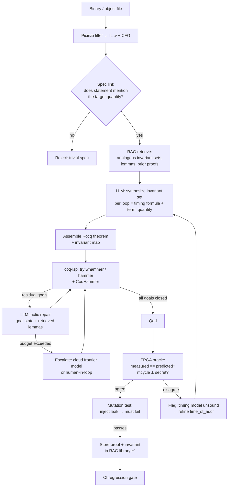

# cloq-agent — Automated Timing-Proof Synthesis for Machine Code

**One-line:** An agentic system that synthesizes and machine-checks **Cloq** timing proofs (WCET + constant-time) over **Picinæ**-lifted binaries, using a local LLM + retrieval, and validates every proof against a **real RISC-V softcore on an FPGA** so that no proof is unsound or trivially true.

> Built on `vendor/picinae` (Picinæ, Rocq/Coq) and Cloq's timing layer (`timing/TimingAutomation.v`, `whammer`/`hammer` tactics). Target ISA: RISC-V (RV32IMC) on NEORV32, the same core Cloq validated against.

---

## 1. Why this design (the load-bearing insight)

Cloq timing proofs have a property ordinary functional-correctness proofs lack: **their structure is isomorphic to the control-flow graph**, and the bulk of each proof is discharged automatically by `repeat step; psimpl; lia` (packaged as `whammer`). The scarce, creative input is the **invariant set** — for each loop, a closed-form timing expression `(c0 − c)·t` plus the termination quantity.

So the agent's job is **not** to search a huge tactic tree. It is to:

1. **Synthesize the invariant set** from the lifted CFG (the hard, creative step), then
2. let Cloq's existing automation close the proof, and
3. **fall back to LLM tactic repair** only on the residual goals automation can't kill.

This reframing is what makes the project tractable on a single workstation and is directly supported by the two strongest current results in the literature:

- **Rango (ICSE '25):** retrieval-augmented proving; proof success drops from **30.0% → 18.6%** when retrieval is removed, and retrieving *both* prior lemmas *and* prior proofs is what matters. ⇒ A growing library of solved invariant sets is the core asset.
- **CoqHammer-first, LLM-fallback** (multiple 2025–26 agentic-Rocq systems): try the symbolic hammer first, invoke the LLM only when it fails. Cloq's `whammer` *is* our cheap first attempt.

---

## 2. Scope & milestones

| # | Milestone | Exit criterion | Job-req coverage |
|---|-----------|----------------|------------------|
| **M0** | **Infra & reproducibility** | One `docker compose up` brings up Rocq + Picinæ + Cloq + `coq-lsp`, a vLLM/Ollama model server on the 5090, and GitLab CI runners. | Linux, Git/GitLab, Docker, CI/CD, GPU compute |
| **M1** | **Proof harness** | Headless driver steps Rocq via `coq-lsp`; compile-first / interactive-fallback loop; `whammer`-first discharge; proves `addloop` (Peano add) end-to-end with no LLM. | Software dev, CI/CD, GPU |
| **M2** | **RAG + invariant synthesis** | Indexed Picinæ/Cloq corpus + proof library; goal-state retrieval; LLM proposes invariant sets. Reproduces `ct-swap` and the FreeRTOS `list.c` "easy four". | LLM, RAG, agentic workflows, Python/PyTorch |
| **M3** | **FPGA validation oracle** | NEORV32 on the FPGA; `mcycle` harness; differential check (measured == predicted) and dudect-style constant-time check wired in as both an eval signal and an anti-vacuity gate. | Prototype eval in operational env, GPU/HW |
| **M4** | **Full agent loop + study** | Planning / repair / budget control; proves `ChaCha20-Block`; **mutation testing** for non-triviality; ablation study (RAG on/off, hammer-first on/off, local vs escalated model). | Agentic AI, model orchestration, evaluation |
| **M5** | **Hardening & transition** | Regression CI gate over all solved targets; metrics dashboard; docs + reproducible demo; "mature prototype → deployable capability" write-up. | Maturation to deployable capability, docs/comms |

Stretch: `vListInsert` (cyclic doubly-linked list, node-uniqueness reasoning — the paper's hardest single proof) and a second ISA timing module (ARMv7 or MSP430) to demonstrate generality.

---

## 3. Targets to start with (gold-labeled)

These are chosen because the Cloq paper already has **expert proofs and measured cycle counts** for them — i.e. a ready-made labeled eval set with ground truth on both the proof side and the hardware side.

**Smoke test (pipeline bring-up)**
- `addloop` — Peano addition loop. One invariant, closes with `whammer`. Validates lift → CFG → invariant → proof → FPGA end-to-end.

**WCET track — FreeRTOS `list.c`** (scheduler-critical linked lists)
- `vListInitialise`, `vListInitialiseItem`, `vListInsertEnd`, `uxListRemove` — the set one expert proved in ~1 hr total. **Start here.**
- `vListInsert` — loop with complex termination over a cyclic list; ~15 expert-hours. **Stretch.**

**Constant-time crypto track**
- `ct-swap` — OpenSSL conditional constant-time swap, ~50 lines Rocq, 20 expert-min. **Best first crypto target.** (Bonus: lets us reproduce the GoFetch/DMP caveat — constant-time *given* no data-memory-dependent prefetcher.)
- `ChaCha20-Block` — core of ChaCha20, ~80 lines Rocq, 2 expert-hr; measured **13 624 cycles** on NEORV32 (predicted range 12 375–14 849). **Primary crypto demo.**

Gold labels per target: a known-good proof script, a known invariant set, and a measured cycle count / closed-form prediction.

---

## 4. The FPGA oracle — making proofs *grounded* and *non-trivial*

A formal timing proof can fail to mean anything in two ways. The FPGA addresses both, alongside in-proof guards.

### 4.1 Soundness & tightness (anti-vacuity #1)
Synthesize **NEORV32** on the FPGA in a **fixed, deterministic config**: caches off, von-Neumann bus contention modeled, `Zicntr` enabled so `mcycle`/`minstret` are available. Bracket the function under test with CSR reads:

```
csrr t0, mcycle      # start
call  target
csrr t1, mcycle      # end → measured = t1 - t0
```

Sweep inputs and assert **measured == Cloq-predicted closed form `f(inputs)`** for every sample. A proof of a *wrong* timing model, or a degenerate/loose bound, fails here. (NEORV32 is multi-cycle, so the per-instruction `time_of_addr` table must match the synthesized config — the FPGA is what calibrates and then checks it.)

### 4.2 Constant-time, genuinely (anti-vacuity #2)
For crypto targets, run a **dudect-style fixed-vs-random** secret sweep and assert `mcycle` is invariant across secret values. Two failure modes caught:
- **Unsound model:** formal proof says "timing ⟂ secret" but hardware shows variance ⇒ the timing model is wrong.
- **Trivially constant-time:** the function never branches on the secret at all. Caught by the **mutation test** below, not by measurement alone.

### 4.3 Non-triviality, enforced (the "not trivially true" requirement)
Three layers, in increasing strength:

1. **Reachability is free.** Picinæ's symbolic interpreter emits a goal for *every* branch target; any unreachable invariant point must be closed by contradiction. A vacuous "invariant never reached" cannot silently pass — it surfaces as an open goal.
2. **Specification non-degeneracy check.** Static lint on the theorem statement: the secret variable must appear free in the constant-time postcondition; the WCET bound must be a non-constant function of the loop counter where the CFG has a data-dependent loop. A proof whose statement doesn't even mention the quantity of interest is rejected before it's attempted.
3. **Mutation / metamorphic testing.** Inject a known timing leak (flip one branch to depend on the secret, or add a secret-indexed delay) and re-run the *same* harness. The proof **must** now fail **and** the FPGA **must** now show variance. If either still "passes," the harness or spec was trivial — and we've detected it automatically.

This triad (formal reachability + spec lint + mutation) is the real answer to *"is the proof trivially true?"*, with the FPGA providing the empirical ground truth that a pure-formal pipeline can't.

---

## 5. Agent-loop architecture



**Loop control:** per-goal iteration cap and token budget; `whammer`/CoqHammer always tried before any LLM call; every solved proof is fed back into the retrieval library (Rango-style skill accumulation), so the system gets monotonically better at the target domain.

---

## 6. Repo layout

```
cloq-agent/
├── NOTICE.md
├── docker/
│   ├── Dockerfile.rocq          # Rocq + Picinæ + Cloq + coq-lsp, pinned versions
│   ├── Dockerfile.llm           # vLLM/Ollama serving on CUDA (5090)
│   └── compose.yaml             # rocq + llm + fpga-bridge + vector-db
├── vendor/
│   └── picinae/                 # Picinæ + Cloq timing layer (submodule/pinned)
├── agent/
│   ├── orchestrator.py          # the loop in §5; budgets, escalation
│   ├── invariant_synth.py       # CFG → invariant-set proposals (LLM)
│   ├── tactic_repair.py         # residual-goal repair (LLM)
│   ├── coqlsp_driver.py         # coq-lsp step/compile, goal extraction
│   ├── hammer.py                # whammer / CoqHammer first-pass
│   └── models.py                # local (Qwen-Coder) + optional cloud escalation
├── rag/
│   ├── index.py                 # embed Picinæ/Cloq corpus + proof library
│   ├── retriever.py             # goal-state → {lemmas, invariants, proofs}
│   └── corpus/                  # extracted lemma sigs, docstrings, solved proofs
├── lift/
│   ├── lift.sh                  # binary → Picinæ IL .v
│   └── cfg.py                   # CFG extraction + loop detection
├── fpga/
│   ├── neorv32/                 # pinned core + fixed deterministic config
│   ├── bitstream/               # build scripts (vendor toolchain)
│   ├── harness.c                # mcycle/minstret bracketing + UART report
│   ├── measure.py               # host driver: flash, sweep inputs, collect cycles
│   └── dudect.py                # fixed-vs-random constant-time test
├── eval/
│   ├── targets/                 # addloop, list.c set, ct-swap, chacha20
│   ├── gold/                    # known proofs, invariants, cycle counts
│   ├── harness.py               # run agent over targets, collect metrics
│   ├── mutate.py                # inject timing leaks for non-triviality test
│   └── ablations.py             # RAG on/off, hammer-first on/off, model tier
├── .github/workflows/          # ci.yml (lint → pytest → rocq smoke), build.yml, nightly.yml
└── docs/
    ├── SPEC.md                  # this file
    └── results/                 # dashboards, ablation tables
```

---

## 7. Eval harness

Run the agent over `eval/targets/`, compare against `eval/gold/`. Metrics:

- **Proof success rate** — compiles **and** `Qed` on held-out targets.
- **Cost per proof** — wall-clock, tokens, # agent iterations, # LLM calls vs hammer-only closes.
- **Invariant accuracy** — proposed invariant matches a gold invariant up to α-equivalence, or `whammer` closes from it.
- **FPGA agreement** — `|measured − predicted|` (exact model ⇒ 0) and constant-time variance (⇒ 0).
- **Non-triviality** — % of mutation-injected leaks that the pipeline catches (proof breaks *and* FPGA shows variance). Target: 100%.
- **Regression** — every previously solved target still passes (CI gate).

**Ablations (the interview talking point):** reproduce Rango's finding locally — measure success with RAG removed, with `whammer`/hammer-first removed, and local-only vs cloud-escalated. Report a table like Rango's retriever ablation.

---

## 8. Stack & hardware

- **Proof engine:** Rocq/Coq + Picinæ + Cloq; `coq-lsp` for programmatic stepping; CoqHammer as ATP first-pass.
- **Local LLM (5090, 32 GB):** Qwen3-Coder-30B (Q4–Q8) or Qwen2.5-Coder-32B as the workhorse — both fit with context headroom; local code-aware embedder for RAG. **Hybrid escalation** to a cloud frontier model only on budget-exceeded hard goals (the cost-minimizing pattern).
- **Serving:** vLLM or Ollama in a CUDA container; PyTorch for any embedding/eval tooling (matches the job's PyTorch/NumPy/Pandas ask).
- **FPGA:** NEORV32 RV32IMC + `Zicntr`, caches off, deterministic memory; host bridge over UART/JTAG. (RTOS-capable NEORV32 ≈ 2300 LUTs / 1000 FFs — comfortable on any mid-range board.)
- **Infra:** Linux, Docker Compose, GitLab CI/CD; vector DB for the proof library.

---

## 9. Risks & mitigations

- **Lifting fidelity** — start from binaries Cloq already lifts (RV32); add new lifts only after the smoke target passes.
- **Timing-model drift vs silicon** — the FPGA oracle *is* the mitigation; calibrate `time_of_addr` against measured `mcycle`, then gate on agreement.
- **LLM invariant hallucination** — never trusted: every proposal must survive `coq-lsp` + Rocq's kernel. Wrong invariants cost time, not soundness.
- **Cyclic-list reasoning (`vListInsert`)** — keep as stretch; needs the node-uniqueness theory the paper spent 15 expert-hours on.
- **Multi-cycle/contention surprises** — fix the SoC config and document it; treat any unexplained mismatch as a model bug, not noise.

---

## 10. How this maps to the role

Every required skill is exercised by a load-bearing component, not bolted on: LLM + RAG + agentic workflows (the proof agent), GPU/CUDA (local serving on the 5090), model orchestration (hammer ↔ LLM ↔ escalation), Linux/Git/GitLab/Docker/CI-CD (the whole harness), Python/PyTorch (agent + eval), and "maturation of a research prototype into a reliable, evaluable capability in an operationally relevant environment" — which is *literally* M3–M5: taking Cloq from expert-only proofs to an automated, hardware-validated pipeline with a regression gate.
